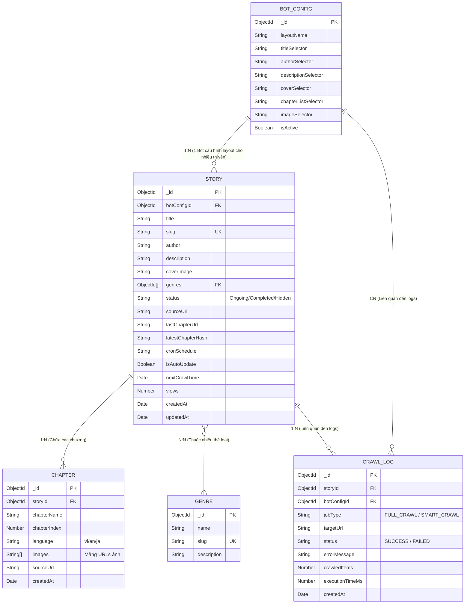

# Thiết kế Cơ sở dữ liệu (Database Design)
**Dự án:** Hệ thống Web Đọc Truyện & Quản lý Bot Crawl Data (MangaBot)  
**Hệ quản trị CSDL:** MongoDB  
**ORM/ODM:** Mongoose  
**Phiên bản:** Thiết kế V4.8 — 1:N BotConfig, Upsert Chapters, Tối ưu Cron & Bảo mật

Dưới đây là định nghĩa Schema chi tiết cho các Collection trong MongoDB của dự án MangaBot.

---

### Sơ đồ Thực thể Liên kết (Entity-Relationship Diagram — ERD)
Sơ đồ dưới đây thể hiện mối quan hệ (1-N, N-N) giữa các Collections trong MongoDB:

---

### 1. Collection: `bot_configs`
Lưu trữ chi tiết các CSS Selectors để bóc tách dữ liệu DOM HTML cho nguồn cào `dilib.vn`.

| Trường | Kiểu dữ liệu | Bắt buộc | Khóa | Mô tả |
|---|---|---|---|---|
| `_id` | ObjectId | Có | PK | Khóa chính tự sinh |
| `layoutName` | String | Có | - | Tên gợi nhớ cho bộ cấu hình layout này (VD: `"Dilib Mobile"`) |
| `titleSelector` | String | Có | - | CSS Selector trỏ tới Tiêu đề truyện ở trang chi tiết |
| `authorSelector` | String | Không | - | CSS Selector trỏ tới Tác giả ở trang chi tiết |
| `descriptionSelector` | String | Không | - | CSS Selector trỏ tới Mô tả/Tóm tắt truyện |
| `coverSelector` | String | Không | - | CSS Selector trỏ tới ảnh bìa truyện |
| `chapterListSelector` | String | Có | - | CSS Selector danh sách chương (Bắt buộc) |
| `imageSelector` | String | Có | - | CSS Selector mảng ảnh đọc truyện (Bắt buộc) |
| `isActive` | Boolean | Có | - | Trạng thái hoạt động của con Bot này (Default: `true`) |

---

### 2. Collection: `stories`
Lưu trữ thông tin chung (metadata) và cài đặt lập lịch cào của một bộ truyện.

| Trường | Kiểu dữ liệu | Bắt buộc | Khóa | Mô tả |
|---|---|---|---|---|
| `_id` | ObjectId | Có | PK | Khóa chính tự sinh |
| `botConfigId` | ObjectId | Có | FK | Khóa ngoại trỏ về `bot_configs._id` |
| `selectorOverrides` | Object | Không | - | Chứa các custom CSS selectors ghi đè `bot_configs` cho riêng truyện này (VD: `{ imageSelector: ".custom-img" }`) |
| `title` | String | Có | - | Tên bộ truyện |
| `slug` | String | Có | UK | URL thân thiện, Unique Index |
| `author` | String | Không | - | Tên tác giả |
| `description` | String | Không | - | Tóm tắt nội dung truyện |
| `coverImage` | String | Không | - | URL ảnh bìa (Cloudinary CDN URL) |
| `genres` | [ObjectId] | Không | FK | Mảng khóa ngoại trỏ về `genres._id` |
| `status` | String | Có | - | Trạng thái truyện: `Ongoing`, `Completed`, `Hidden` |
| `sourceUrl` | String | Có | - | URL trang gốc chi tiết của bộ truyện trên web nguồn |
| `lastChapterUrl` | String | Không | - | URL trang đọc của chương mới nhất đã cào thành công. Dùng làm điểm tựa để check cập nhật. |
| `latestChapterHash` | String | Không | - | MD5 hash của dữ liệu chương cuối để kiểm tra cập nhật thầm lặng. |
| `cronSchedule` | String | Không | - | Biểu thức Cron lập lịch quét cho truyện này (VD: `*/30 * * * *`). |
| `isAutoUpdate` | Boolean | Có | - | Bật/tắt tự động cào cho truyện này (Default: `true`) |
| `nextCrawlTime` | Date | Không | - | Thời gian dự kiến cho lần cào tiếp theo |
| `views` | Number | Không | - | Tổng số lượt xem truyện (Default: `0`) |
| `createdAt` | Date | Có | - | Thời gian tạo truyện |
| `updatedAt` | Date | Có | - | Thời gian cập nhật truyện gần nhất |

---

### 3. Collection: `chapters`
Lưu trữ nội dung chi tiết từng chương (chỉ lưu bản dịch đầy đủ đã kiểm duyệt).

| Trường | Kiểu dữ liệu | Bắt buộc | Khóa | Mô tả |
|---|---|---|---|---|
| `_id` | ObjectId | Có | PK | Khóa chính tự sinh |
| `storyId` | ObjectId | Có | FK | Khóa ngoại trỏ về `stories._id` |
| `chapterName` | String | Có | - | Tên chương (VD: `Chapter 1`, `Chương 2`) |
| `chapterIndex` | Number | Có | - | Số thứ tự chương để sắp xếp (VD: `1`, `2.5`) |
| `language` | String | Không | - | Mã ngôn ngữ (VD: `vi`). Default: `vi` |
| `images` | [String] | Có | - | Mảng URLs ảnh đã nén .webp từ Cloudinary |
| `sourceUrl` | String | Có | - | URL gốc của chương này trên trang nguồn |
| `createdAt` | Date | Có | - | Thời gian tạo chương |
| `updatedAt` | Date | Có | - | Thời gian cập nhật chương gần nhất (Dùng cho Smart Crawl) |

---

### 4. Collection: `crawl_logs`
Lịch sử chạy cào để phục vụ kiểm soát lỗi và thống kê.

| Trường | Kiểu dữ liệu | Bắt buộc | Khóa | Mô tả |
|---|---|---|---|---|
| `_id` | ObjectId | Có | PK | Khóa chính tự sinh |
| `storyId` | ObjectId | Không | FK | Khóa ngoại trỏ về `stories._id`. Có thể rỗng nếu lỗi cào metadata ban đầu. |
| `botConfigId` | ObjectId | Có | FK | Khóa ngoại trỏ về `bot_configs._id` |
| `jobType` | String | Có | - | Tác vụ: `FULL_CRAWL` hoặc `SMART_CRAWL` |
| `targetUrl` | String | Có | - | URL nguồn được cào trong job này |
| `status` | String | Có | - | Trạng thái: `SUCCESS` hoặc `FAILED` |
| `errorMessage` | String | Không | - | Chi tiết lỗi nếu `status` = `FAILED` |
| `crawledItems` | Number | Không | - | Số chương đã tải được |
| `executionTimeMs`| Number | Có | - | Thời gian chạy (ms) |
| `createdAt` | Date | Có | - | Thời gian ghi nhận (Tự xóa sau 30 ngày qua TTL index) |

---

### 5. Collection: `genres`
Danh mục các thể loại truyện đọc.

| Trường | Kiểu dữ liệu | Bắt buộc | Khóa | Mô tả |
|---|---|---|---|---|
| `_id` | ObjectId | Có | PK | Khóa chính tự sinh |
| `name` | String | Có | - | Tên thể loại truyện (VD: `"Hành Động"`) |
| `slug` | String | Có | UK | Slug thân thiện, Unique Index (VD: `"hanh-dong"`) |
| `description` | String | Không | - | Mô tả chi tiết thể loại truyện |

---

### Các Indexes Quan Trọng
| Collection | Index Fields | Type | Mục đích |
|---|---|---|---|
| `bot_configs` | `{ layoutName: 1 }` | Unique | Tránh trùng lặp tên cấu hình layout |
| `stories` | `{ slug: 1 }` | Unique | Tối ưu hiển thị và truy vấn URL truyện của khách đọc |
| `stories` | `{ botConfigId: 1 }` | Normal | Hỗ trợ truy vấn danh sách truyện theo Bot Config |
| `stories` | `{ isAutoUpdate: 1, nextCrawlTime: 1 }`| Compound | Tối ưu câu lệnh quét lấy hàng đợi truyện cào của Scheduler |
| `chapters` | `{ storyId: 1, chapterIndex: 1 }` | Unique | Compound Unique Index: Đảm bảo tính Idempotency, chống lưu trùng chương |
| `chapters` | `{ storyId: 1, chapterIndex: -1 }` | Compound | Sắp xếp và load danh sách chương nhanh cho độc giả đọc |
| `crawl_logs` | `{ createdAt: 1 }` | TTL (30d) | Tự động dọn dẹp logs thừa sau 30 ngày |
