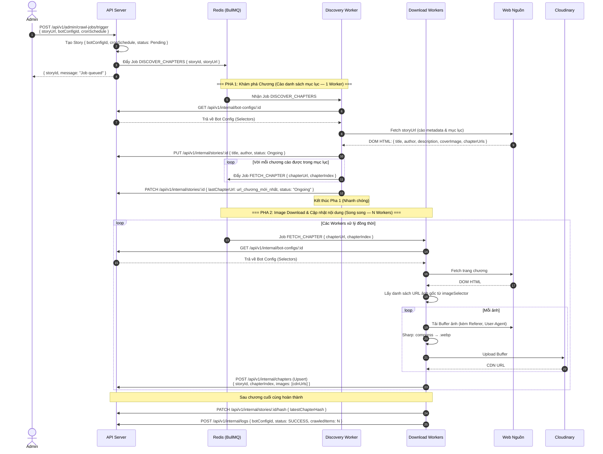
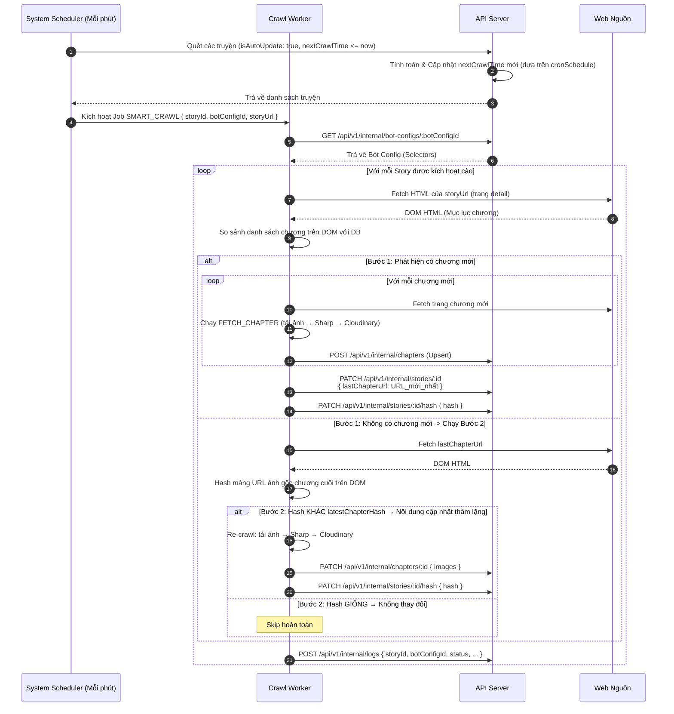
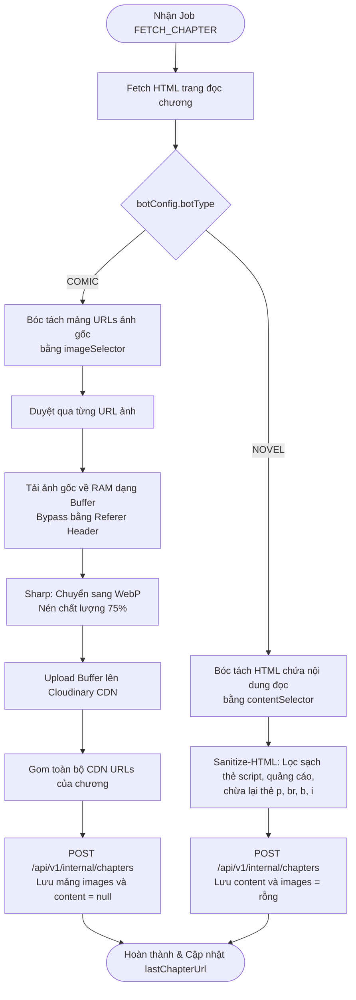
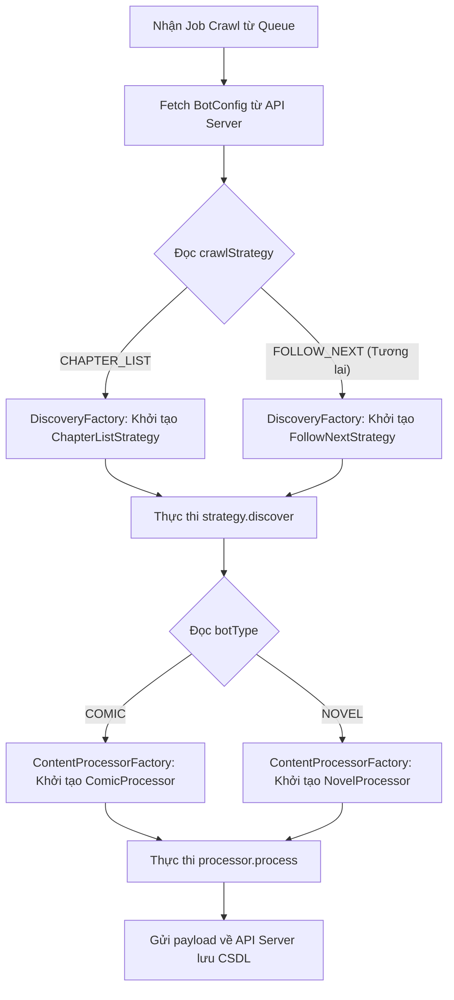
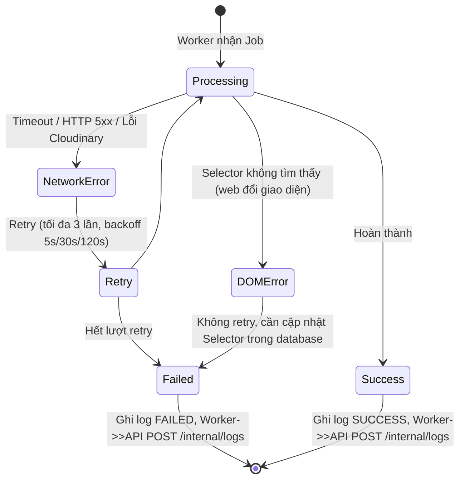
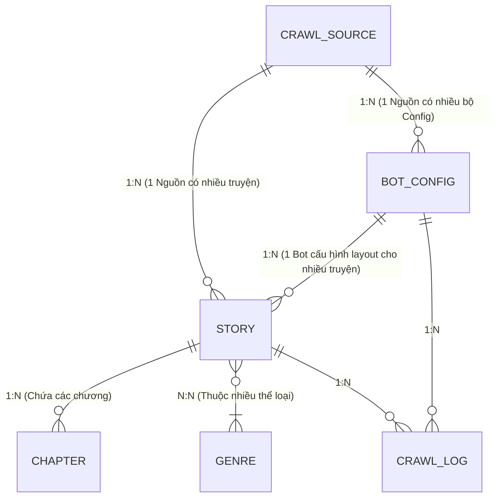
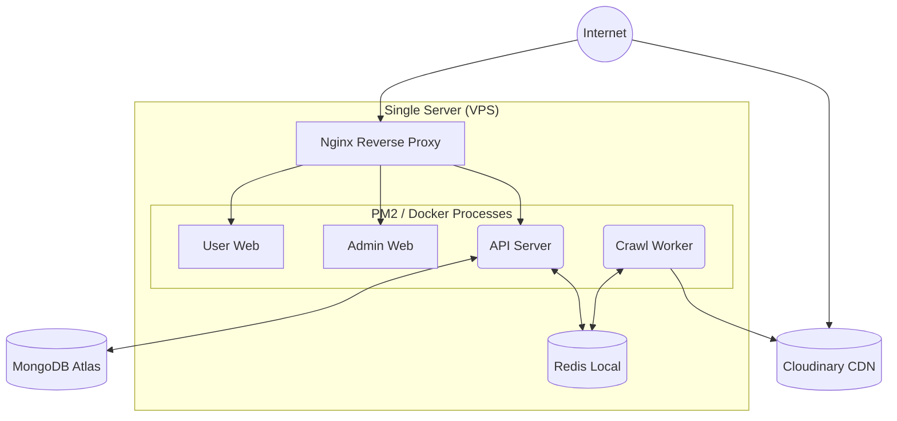

# Tài liệu Đặc tả Thiết kế Phần mềm & Hệ thống (System & Software Design Specification - SDS)
**Dự án:** Hệ thống Web Đọc Truyện & Quản lý Bot Crawl Data (MangaBot)  
**Phiên bản:** 1.0 (Bản đặc tả thiết kế chính thức V4.8)  
**Ngày cập nhật:** 2026-07-13

---

## 1. Tổng quan Kiến trúc (High-Level Architecture)

Hệ thống được thiết kế theo mô hình tách biệt các phân hệ (Component Separation) để đảm bảo khả năng mở rộng tốt và tính chịu lỗi độc lập.

### 1.1 Sơ đồ kiến trúc tổng quan
```mermaid
graph TD
    subgraph "Clients"
        User[User Frontend]
        Admin[Admin Portal]
    end

    subgraph "Backend Services"
        API[Main API Server\nExpress/NestJS]
        Queue[(Message Queue\nRedis/BullMQ)]
    end

    subgraph "Crawl Worker"
        Crawler[Crawler App\nNode.js/Puppeteer]
    end

    subgraph "External Resources"
        MangaWeb[Manga Sources\nHTML/DOM]
        Storage[Cloudinary CDN]
    end

    subgraph "Databases"
        DB[(MongoDB)]
    end

    User -->|REST| API
    User -->|Load Images| Storage
    Admin -->|REST/Socket.io| API
    API -->|Read/Write| DB
    API -->|Add Jobs| Queue
    
    Crawler -->|Consume Jobs| Queue
    Crawler -->|Fetch DOM| MangaWeb
    Crawler -->|Upload Images| Storage
    Crawler -->|POST Data (REST Client)| API
```

### 1.2 Nguyên tắc thiết kế cốt lõi
1.  **Crawl Worker không truy cập trực tiếp Database:** Mọi đọc/ghi dữ liệu vào MongoDB đều phải đi qua các endpoints bảo mật của API Server, sử dụng xác thực qua `X-Internal-Token`.
2.  **API Server là Gateway duy nhất:** Chịu trách nhiệm kiểm duyệt dữ liệu đầu vào và quản lý trạng thái của các bộ truyện.
3.  **Queue là bộ đệm chịu tải:** Mọi tác vụ cào nặng hoặc cào định kỳ đều được đẩy vào BullMQ để tránh gây nghẽn tiến trình của API Server.

---

## 2. Thiết kế API Server

### 2.1 Cấu trúc module
Hệ thống API Server được thiết kế theo mô hình phân lớp chuẩn: `Router → Middleware → Controller → Service → Mongoose Model`.

```
src/
├── modules/
│   ├── auth/           → POST /api/v1/admin/auth/login
│   ├── stories/        → CRUD /api/v1/stories
│   ├── chapters/       → CRUD /api/v1/chapters
│   ├── genres/         → CRUD /api/v1/genres
│   ├── sources/        → CRUD /api/v1/admin/sources
│   ├── bot-configs/    → CRUD /api/v1/admin/bot-configs
│   ├── crawl-jobs/     → POST /api/v1/admin/crawl-jobs/trigger
│   └── crawl-logs/     → GET /api/v1/admin/logs
├── internal/           → Nhóm routes nghiệp vụ riêng cho Worker
│   ├── stories/        → API lấy danh sách due, cập nhật hash/lastChapterUrl
│   ├── bot-configs/    → API lấy selectors chi tiết
│   ├── chapters/       → API lưu chương mới, cập nhật đè chương
│   └── logs/           → API lưu nhật ký chạy cào
└── middlewares/
    ├── auth.ts         → Middleware verify JWT Token cho Admin Portal
    └── internal.ts     → Middleware verify X-Internal-Token cho Crawl Worker
```

### 2.2 Danh sách API Endpoints
Chi tiết các API Endpoints (Public, Admin, Internal) cùng định nghĩa các bảng tham số đường dẫn, tham số truy vấn, request body và response JSON mẫu được mô tả đầy đủ tại **[API_Specification.md](file:///d:/MangaBot/docs/API_Specification.md)**.

---

## 3. Thiết kế Crawl Worker & Workflows

### 3.1 Cấu trúc thư mục
Cấu trúc tổ chức thư mục chi tiết của Crawl Worker cùng cấu trúc Monorepo được đặc tả đầy đủ tại **[Code_Structure.md](file:///d:/MangaBot/docs/Code_Structure.md)**.

### 3.2 Luồng Full Crawl chi tiết (Chapter-List & Kiểm duyệt)
Luồng này thực thi cào toàn bộ chương truyện thông qua việc bóc tách mục lục trang detail:



### 3.3 Luồng Smart Crawl chi tiết (Chapter-List & Tự Chữa Lành)
Luồng này tự động kiểm tra xem nguồn có chương mới hay có cập nhật bản dịch thầm lặng không (so khớp mã MD5 hash để cào đè):



### 3.4 Phân Tách Đường Ống Xử Lý Nội Dung (Comic vs Novel Pipelines)
Sơ đồ thể hiện luồng tải và xử lý nội dung chi tiết của chương truyện tùy thuộc vào loại bot cào (`COMIC` vs `NOVEL`).



### 3.5 Thiết kế Khả năng Mở rộng (Scalability & Extensibility Design)
Hệ thống được thiết kế để dễ dàng mở rộng sang các chiến lược cào mới (như `FOLLOW_NEXT`) và các loại nội dung mới trong tương lai mà không cần thay đổi kiến trúc lõi của Worker. Việc này được thực hiện thông qua **Strategy Pattern** phối hợp với **Factory Pattern** và **Database-Driven Routing** (Định tuyến dựa trên cấu hình Database).

#### 1. Định tuyến dựa trên Cấu hình CSDL (Database-Driven Routing)
Tất cả các hành vi của Crawler đều không được code cứng (hardcode). Khi nhận một Job từ hàng đợi, Worker sẽ dựa vào cấu hình của Bot (`bot_configs`) để định tuyến xử lý:
*   **`botType` (`'COMIC' | 'NOVEL'`)**: Xác định kiểu nội dung của truyện để tải/nén ảnh hay bóc text sạch.
*   **`crawlStrategy` (`'CHAPTER_LIST' | 'FOLLOW_NEXT'`)**: Xác định cách cào chương (lấy toàn bộ mục lục của truyện hay đi tuần tự qua nút Next).

#### 2. Thiết kế các Hợp đồng Interface (Contract Design)
Mọi chiến lược khám phá chương và bộ xử lý nội dung đều phải thực thi một Interface chuẩn hóa. Điều này đảm bảo tính hoán đổi (Interchangeability):
*   **Interface cho Chiến lược khám phá (`IDiscoveryStrategy`):**
    ```typescript
    export interface IChapter {
      chapterName: string;
      chapterIndex: number;
      sourceUrl: string;
    }

    export interface IDiscoveryStrategy {
      discover(storyUrl: string, config: BotConfigDto): Promise<IChapter[]>;
    }
    ```
*   **Interface cho Bộ xử lý nội dung (`IContentProcessor`):**
    ```typescript
    export interface IProcessedContent {
      images?: string[]; // Dành cho COMIC
      content?: string;  // Dành cho NOVEL
    }

    export interface IContentProcessor {
      process(chapterUrl: string, config: BotConfigDto): Promise<IProcessedContent>;
    }
    ```

#### 3. Sơ đồ Hoạt động của Factory & Strategy (Strategy Routing Flow)


#### 4. Quy trình Mở rộng khi thêm Chiến lược mới (Ví dụ: Thêm `FOLLOW_NEXT`)
Khi hệ thống cần hỗ trợ thêm cào tuần tự Next Button (Follow-Next) ở giai đoạn sau, lập trình viên thực hiện theo 3 bước:
1.  **Cập nhật schema CSDL:** Thêm giá trị `'FOLLOW_NEXT'` vào enum của trường `crawlStrategy` trong Database.
2.  **Tạo Class Chiến lược mới:** Tạo file `follow-next.strategy.ts` thực thi interface `IDiscoveryStrategy` để viết logic tìm nút Next và trả về mảng chương.
3.  **Đăng ký vào Factory:** Cập nhật file `factory.ts` của `DiscoveryFactory` để trả về Class mới khi nhận tham số `'FOLLOW_NEXT'`.

---

## 4. Thiết kế Bảo mật (Security Design)

### 4.1 Xác thực 2 lớp
```
                    ┌─────────────────────────────┐
Internet ──────────►│     Nginx (Layer 1)         │
                    │  Rate limiting / HTTPS       │
                    └────────────┬────────────────┘
                                 │
               ┌─────────────────┼─────────────────┐
               ▼                                   ▼
    ┌──────────────────┐              ┌─────────────────────┐
    │  Public APIs     │              │  Admin/Internal APIs │
    │  No Auth         │              │  Layer 2: JWT hoặc  │
    │  (GET stories,   │              │  X-Internal-Token   │
    │   chapters)      │              └─────────────────────┘
    └──────────────────┘
```

### 4.2 JWT Flow (Admin)
1. Admin gửi POST `/api/v1/admin/auth/login` → API verify password bằng bcrypt → cấp JWT Token (HS256, 24h TTL).
2. Mọi request Admin tiếp theo đính kèm Header: `Authorization: Bearer <token>`.
3. Middleware `auth.ts` verify JWT. Nếu không hợp lệ hoặc hết hạn → Trả về 401 Unauthorized.

### 4.3 Internal Token Flow (Worker)
1. Worker đính kèm Header: `X-Internal-Token: <shared_secret>` vào mọi request gửi tới API Server.
2. Middleware `internal.ts` so khớp với biến môi trường `INTERNAL_SECRET_TOKEN` sử dụng hàm constant-time (`crypto.timingSafeEqual`) để chống Timing Attack.
3. Tường lửa (Firewall) hoặc Cấu hình mạng (VPC) chặn mọi request đến Internal Endpoints từ bên ngoài (chỉ cho phép localhost hoặc IP của Worker).

---

## 5. Thiết kế Xử lý lỗi & Concurrency (Error Handling)

### 5.1 Phân loại lỗi trong Worker
Sơ đồ xử lý lỗi tự động của các Worker chạy tiến trình nền khi gặp sự cố mạng hoặc DOM:



### 5.2 Phân biệt Lỗi có thể Retry và không thể Retry
| Loại lỗi | Có thể Retry? | Hành động |
|---|---|---|
| Network Timeout | ✅ Có | Retry 3 lần với backoff |
| HTTP 429 (Rate Limited) | ✅ Có | Retry sau 60 giây |
| HTTP 5xx từ web nguồn | ✅ Có | Retry 3 lần |
| DOM Selector không tìm thấy | ❌ Không | Log lỗi, đánh dấu FAILED và chờ Admin sửa Selector |
| HTTP 404 (trang không tồn tại) | ❌ Không | Log lỗi, đánh dấu FAILED |
| Cloudinary upload fail | ✅ Có | Retry 3 lần |

### 5.3 Giới hạn Tải & Concurrency (Rate Limiting)
Sử dụng tính năng Rate Limiter của BullMQ trên mỗi Queue tương ứng với một `sourceId` (hoặc Domain). Việc này đảm bảo:
- Khống chế số lượng Request tối đa gửi đến 1 trang web nguồn trong một khoảng thời gian (VD: 5 req/s).
- Chống bị nguồn cào block IP do "dội bom" request quá nhanh khi có hàng ngàn job `FETCH_CHAPTER` được đẩy vào Queue cùng lúc.

### 5.4 Cảnh báo Tự động (Smart Alerting)
Hệ thống tích hợp theo dõi tỷ lệ lỗi (Error Rate) của từng `BOT_CONFIG`.
- Nếu phát hiện số lượng lỗi `DOMError` liên tục vượt ngưỡng (VD: 10 lỗi liên tiếp), hệ thống sẽ gửi Webhook cảnh báo (qua Telegram/Discord/Email) cho Admin.
- Trạng thái của `BOT_CONFIG` sẽ được tự động tạm ngưng (`isActive: false`) để tránh tiêu tốn tài nguyên cho đến khi Admin sửa lại Selector.

---

## 6. Thiết kế Database (tham chiếu)
Chi tiết đầy đủ xem tại **[Database_Design.md](file:///d:/MangaBot/docs/Database_Design.md)**.

### 6.1 Tóm tắt quan hệ


### 6.2 Indexes quan trọng
| Collection | Index | Mục đích |
|---|---|---|
| `crawl_sources` | `{ domain: 1 }` UNIQUE | Truy vấn nguồn cào truyện |
| `bot_configs` | `{ sourceId: 1, isActive: 1 }` | Lấy danh sách layout bot |
| `stories` | `{ slug: 1 }` UNIQUE | Tìm kiếm truyện nhanh theo slug |
| `stories` | `{ botConfigId: 1 }` | Truy vấn các truyện dùng chung một cấu hình Bot |
| `stories` | `{ isAutoUpdate: 1, nextCrawlTime: 1 }` | Scheduler tìm truyện đến hẹn quét tự động |
| `chapters` | `{ storyId: 1, chapterIndex: 1 }` UNIQUE | Compound Unique Index: Đảm bảo tính Idempotency, chống lưu trùng chương |
| `chapters` | `{ storyId: 1, chapterIndex: -1 }` | Load danh sách chương truyện mới nhất |
| `crawl_logs` | `{ createdAt: 1 }` | TTL (30 ngày) tự động dọn dẹp log cũ |

---

## 7. Thiết kế Triển khai (Deployment Architecture)
Mô hình triển khai VPS thông qua Docker Compose hoặc PM2.



---

## 8. Cấu trúc Code (tham chiếu)
Chi tiết đầy đủ xem tại **[Code_Structure.md](file:///d:/MangaBot/docs/Code_Structure.md)**.

### 8.1 Tổng quan Monorepo
```
mangabot/
├── packages/
│   └── database/     ← Mongoose Models dùng chung (API + Worker)
├── apps/
│   ├── api-server/   ← Express/NestJS REST API
│   └── crawler/      ← Worker Process
└── docs/
```

---

## 9. Cấu hình môi trường (Environment Variables)

### `apps/api-server/.env`
```env
PORT=3000
MONGODB_URI=mongodb+srv://...
REDIS_URL=redis://localhost:6379
JWT_SECRET=<strong_random_secret>
INTERNAL_SECRET_TOKEN=<shared_secret_with_crawler>
CLOUDINARY_CLOUD_NAME=...
CLOUDINARY_API_KEY=...
CLOUDINARY_API_SECRET=...
```

### `apps/crawler/.env`
```env
REDIS_URL=redis://localhost:6379
API_BASE_URL=http://localhost:3000
INTERNAL_SECRET_TOKEN=<phải_khớp_với_api_server>
```
